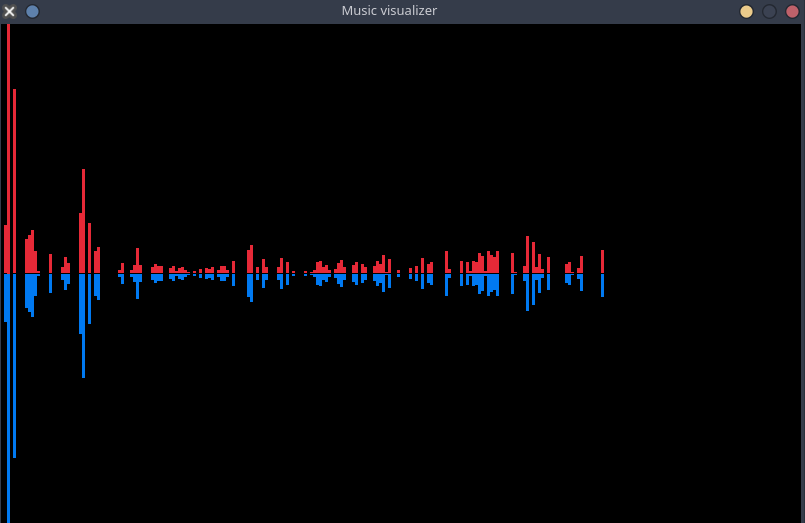

## Music Visualizer

Simple project for visualizing music with fft, using Raylib as a frontend.

## Example usage

The command:
```
bin/visualizer res/still_raving.mp3
```
gives the following result (NOTE: this is likely to change as development continues):


## Planned features
- drag&drop music files
- visualization in terminal
- adding UI in order to change shader code in real time
